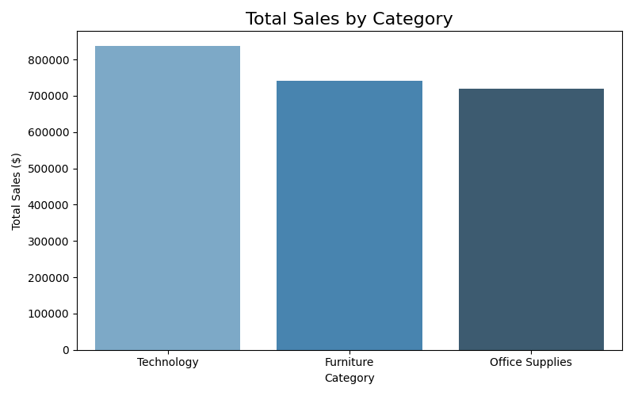
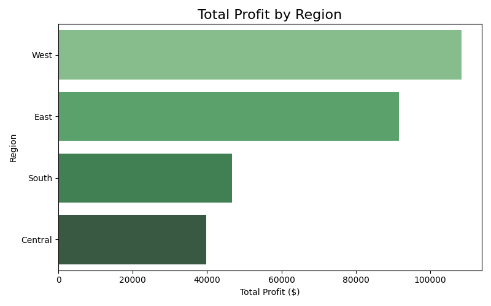
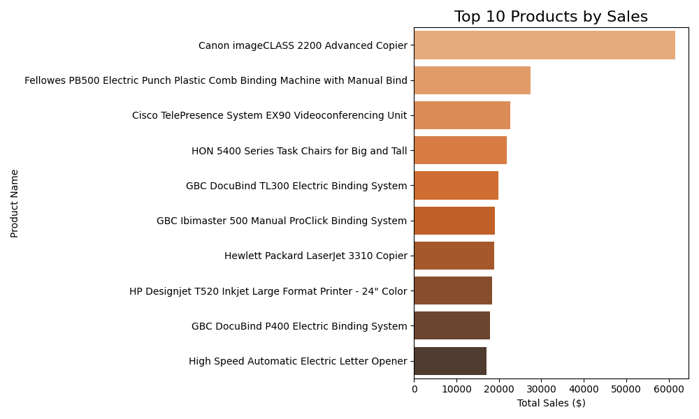
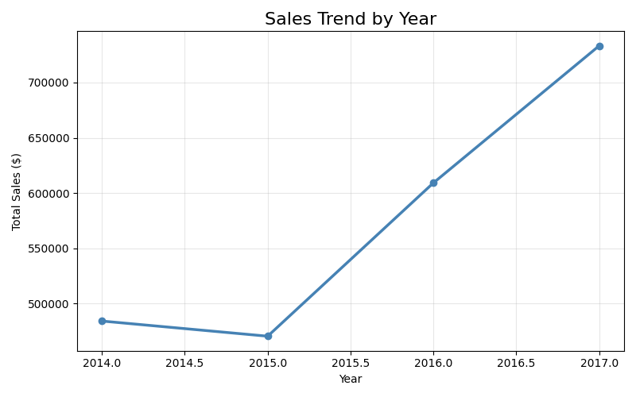
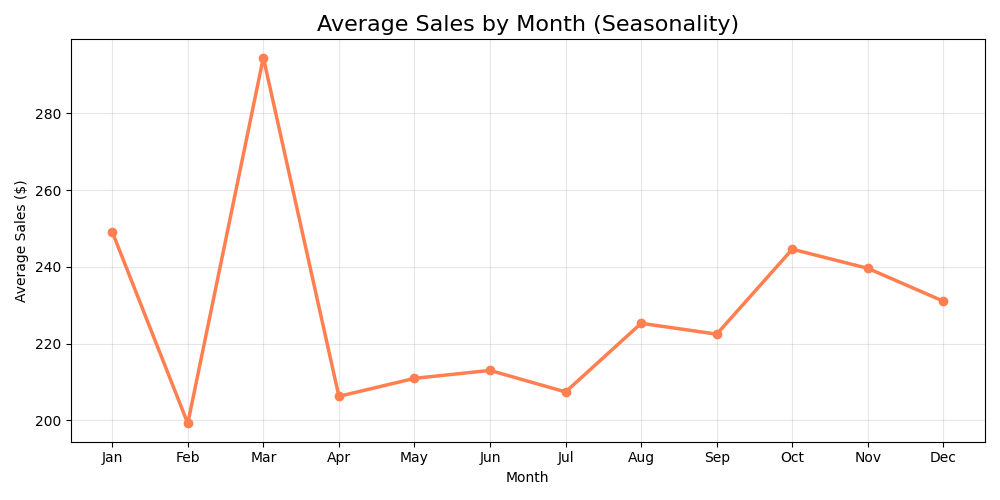

# 🛒 Retail Sales Analysis — Business Intelligence Project

## 📌 Project Overview
This project analyses **4 years of retail transaction data** from a US-based 
superstore to uncover actionable business insights around sales performance, 
regional profitability, and seasonal trends.

The goal was to answer real business questions that a data analyst would 
face on the job — using Python for data cleaning, analysis, and visualisation.

---

## ❓ Business Questions Answered
| # | Question | Finding |
|---|----------|---------|
| 1 | Which product category drives the most revenue? | Technology leads sales |
| 2 | Which region is most profitable? | West region tops profitability |
| 3 | What are the top 10 best-selling products? | Tech products dominate |
| 4 | Is the business growing year over year? | Consistent upward trend |
| 5 | Are there seasonal sales patterns? | Strong Q4 holiday spike |

---

## 📊 Key Visualisations

### Sales by Category

### Profit by Region

### Top 10 Products

### Yearly Sales Trend

### Monthly Seasonality

---

## 🔍 Key Insights
- 📦 **Technology** is the highest revenue category but **Office Supplies** 
  has more consistent profit margins
- 🌍 The **Central region** underperforms significantly in profit despite 
  reasonable sales — suggesting high discounting or operational inefficiency
- 📈 Sales have grown **year over year**, indicating a healthy and expanding business
- 🎄 **November and December** are peak months — ideal for targeted 
  promotional campaigns and increased inventory planning

---

## 🛠️ Tools & Technologies
- **Python 3** — core programming language
- **pandas** — data cleaning and manipulation
- **matplotlib & seaborn** — data visualisation
- **Jupyter Notebook** — analysis environment
- **GitHub** — version control and portfolio hosting
## 📁 Project Structure
retail-sales-analysis/
│
├── sales_analysis.ipynb       ← Main analysis notebook
├── Sample - Superstore.csv    ← Original dataset
├── superstore_cleaned.csv     ← Cleaned dataset
├── chart1_category_sales.png
├── chart2_region_profit.png
├── chart3_top_products.png
├── chart4_yearly_trend.png

## 📂 Dataset
- **Source:** [Kaggle — Superstore Dataset](https://www.kaggle.com/datasets/vivek468/superstore-dataset-final)
- **Size:** 9,994 rows × 21 columns
- **Period:** 2014–2017

---

## 👤 Author
**[Rishit Pandya]**
Master of Data Science Student
University of [Adelaide university], Adelaide SA

📧 [rishitpandya22@gmail.com]
🔗 [www.linkedin.com/in/
rishit-pandya-854b7928a
]
